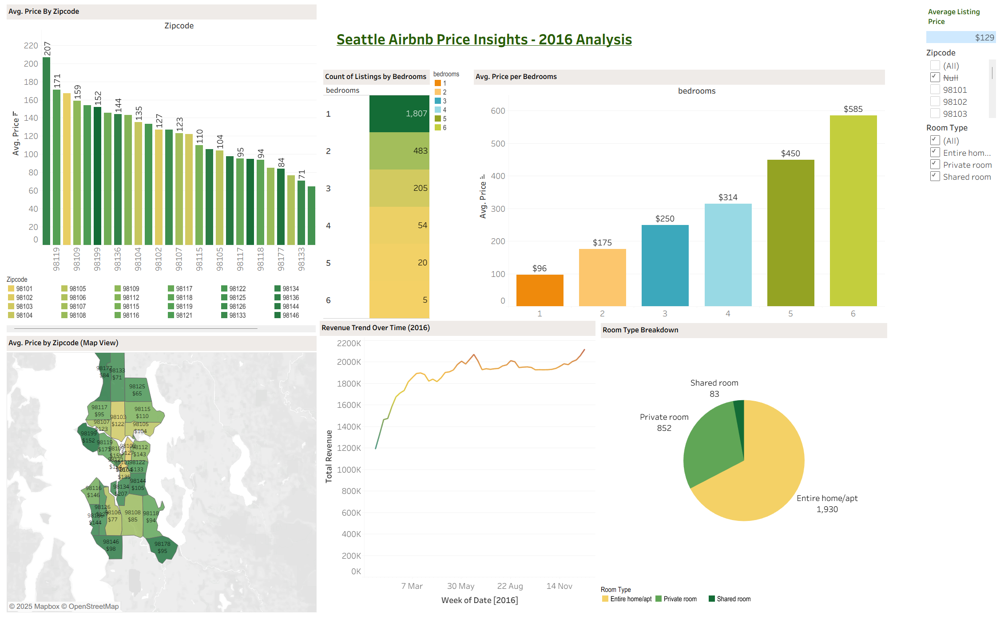

# Airbnb Listing & Price Explorer

This Tableau project explores Seattle Airbnb data to identify pricing trends, room type breakdowns, and listing availability patterns. The dashboard uses public Airbnb data from 2016 and focuses on visualizing key performance indicators across neighborhoods.

## Dashboard Preview

> Click the image to explore the **live dashboard** on Tableau Public.

---

## Key Insights

- **Average Price by Zipcode** - Bar and map view of pricing across neighborhoods
- **Room Type Breakdown** - Pie chart showing distribution of listing types
- **Average Price per Bedroom** - Cost comparisons by bedroom count
- **Revenue Trend** - Weekly total revenue trend over time
- **KPI** - Average listing price (for all listings)

---

## Files Included

- `Airbnb Listings Dashboard.twbx` - Tableau packaged workbook  
- `airbnb-dashboard.png` - Static dashboard preview image  
- `cAirbnb Dataset` - Full Airbnb Seattle dataset *(reviews excluded in dashboard)*

---

## Data Details

- Data Source: Seattle Airbnb Open Data (2016)
- Joined `listings.csv` and `calendar.csv` in Tableau via `id`
- *`reviews.csv` was excluded from visualizations due to file size and lack of usage in insights*

---

## Tools Used

- **Tableau Public** - For building and publishing dashboards
- **Excel** - For filtering and previewing dataset structure
