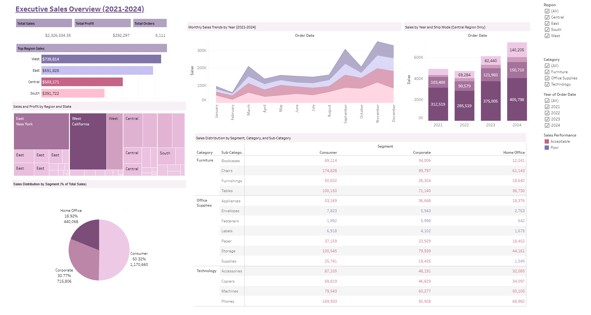

# Superstore Sales & Performance Dashboard

This Tableau project analyzes sales performance from a fictional Superstore dataset (2021–2024), designed for both executive overview and in-depth performance diagnostics.

## Dashboards Included

- **Executive Overview** – High-level KPIs, monthly trends, sales by region and segment
- **Performance Analyzer** – Profit outliers, quarterly heatmap, sub-category performance

> Preview: Executive Overview & Analytical Dashboard (click the link below for interactive version)

## View Live on Tableau Public

[**Superstore Sales & Performance Dashboard**](https://public.tableau.com/app/profile/shristi.tuladhar6499/viz/SuperstoreSalesPerformanceDashboard_17536767511400/ExecutiveDashboard)

## Files Included

- `Superstore Visualization & Dashboard.twbx` - Tableau packaged workbook (all dashboards and data)
- `Superstore Sales Performance Dataset.xlsx` - Original dataset used

## Tools Used

- Tableau Public Desktop
